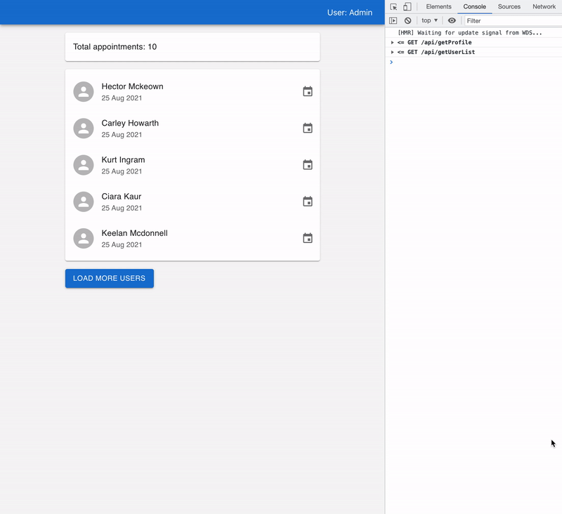
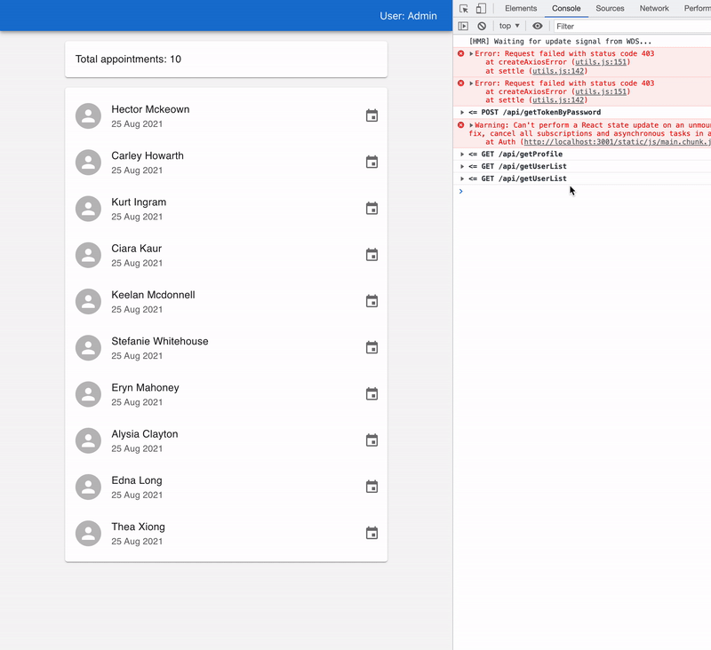
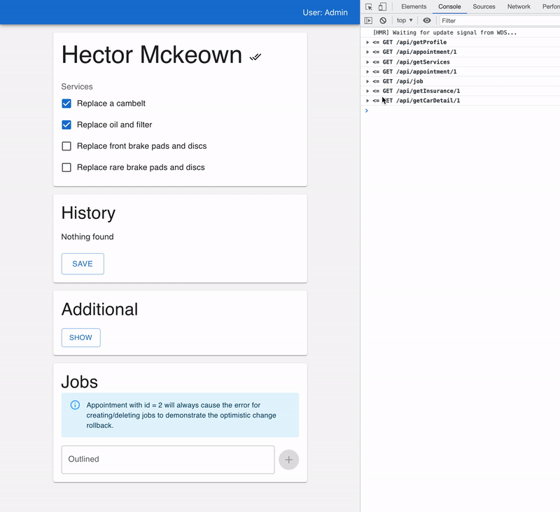
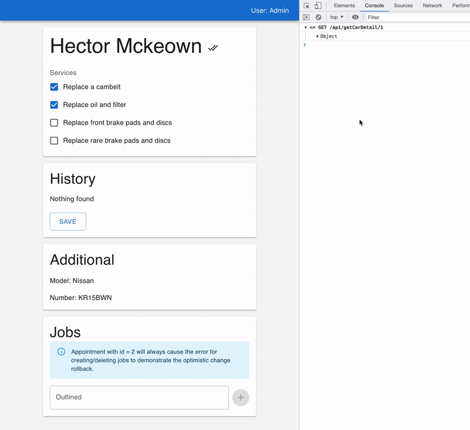

# Building the real app with React Query

An example of building the app using React Query.

**Demo:** https://react-query-tutorial.herokuapp.com/

The project is written in TypeScript and uses CRA, React query, axios mock server and material UI for easier prototyping.

## Functionality

- Login using email and password and indicate the logged user
- Show the list of next appointments with load more feature
- Show information about one particular appointment
- Save and view changes history
- Prefetch additional information
- Add and amend required jobs

### Cases covered in the app:

- Deduping multiple requests for the same data into a single request

  

- Updating "out of date" data in the background (on window focus)
                                          

  

- Lazy loading list
                    

  

- Prefetching the data
                

  

- Mutations and optimistic changes
             
_Success:_

  

_Fail:_

  

- Suspense and Error Boundaries

_The detailed article is coming soon..._
